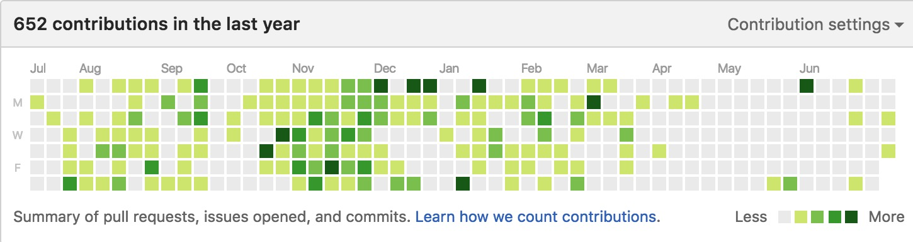

> As the number of my repos keeps increasing, I have to create this new repo in order to create some kinds of **index** for all the repos that I have written.

# Get to know me

Sergio Chan, Born Hacker, Currently works at *RavenTech. Inc* as a Researcher and Hacker

[My blog](http://sergiochan.xyz)  |  [Linkedin](https://cn.linkedin.com/pub/sergio-chan/42/14b/a6) | [Weibo](http://weibo.com/3089081773/profile?topnav=1&wvr=6) 

# Below is the list of most of my repos 

> 下面是我大部分的个人仓库的分类列表

### Algorithm Test 算法测试实现类

- [Monty-Hall-Problem](https://github.com/SergioChan/Monty-Hall-Problem-Swift) 三门问题的Swift验证演示Playground
- [LinkedListSwift](https://github.com/SergioChan/LinkedListSwift) Swift写的链表实现和各种基本操作
- [SCPythonSudoku]( https://github.com/SergioChan/SCPythonSudoku ) A Python Sudoku solved program. Python写的深度优先搜索解数独程序

### Kit or Framework for iOS 实用控件类

- [SCBlueToothKit](https://github.com/SergioChan/SCBlueToothKit) Blue Tooth Kit based on Core BlueTooth brings you to fly dealing with Blue Tooth development
- [SCAwesomeNetworking](https://github.com/SergioChan/SCAwesomeNetworking) An optimized networking framework based on AFNetworking and ProtoBuffer
- [SCImagePicker](https://github.com/SergioChan/ImagePicker) A highly encapsulated and fully functional open-source image picker written in Objc based on Photokit. Including album list, asset list, selection preview, camera and short video taking
- [SCTableViewCell](https://github.com/SergioChan/SCTableViewCell) Swipe-to-Delete Effects like iOS Native Mail App。一个模仿iOS8中的邮箱里面的cell删除动效以及滑动右侧菜单按钮效果的开源库
- [SCNavigationControlCenter](https://github.com/SergioChan/SCNavigationControlCenter) This is an advanced navigation control center on iOS that can allow you to navigate to whichever view controller you want. iOS上的改进的导航栏控制中心。
- [SCActivityIndicatorView](https://github.com/SergioChan/SCActivityIndicatorView) An indicator view providing you more freedom to control and customize it.一个魔性的菊花控件，助你摆脱系统菊花的各种烦恼
- [SCRealm2SQLORM](https://github.com/SergioChan/SCRealm2SQLORM) A realm ORM kit transferring realm usage to traditional SQLite usage. Just for learning and practicing.这是一个简单的realm的类似sqlite的数据库接口库。可以给熟悉sql语法，新入门realm的新手参考
- [SCTagWriteView](https://github.com/SergioChan/SCTagWriteView) An input custom view providing you ability to add and remove tags
- [TUCalender](https://github.com/SergioChan/TUCalender) 根据业务需要基于JTCalendar改写的日历控件
- [UILabel-AttributedText](https://github.com/SergioChan/UILabel-AttributedText) This is a solution category for UILabel to deal with the issue about special chracters.

### Test on iOS Basic Frameworks iOS基础框架的测试实现类

- [RunloopTest](https://github.com/SergioChan/RunloopTest)  This is a demo project for one of my blogs
- [id-NSObjectDemo](https://github.com/SergioChan/id-NSObjectDemo) This is a demo project for one of my blogs

### Animations on iOS 动画类

- [SCTrelloNavigation](https://github.com/SergioChan/SCTrelloNavigation) An iOS native implementation of a Trello Animated Navagation. iOS上类似trello的导航动效控件实现。
- [SCCatWaitingHUD](https://github.com/SergioChan/SCCatWaitingHUD) This is a cute and simple loading HUD on iOS :-P 这是一个可爱清新简单的加载HUD控件
- [SCCinemaAnimation](https://github.com/SergioChan/SCCinemaAnimation)  An iOS native implementation of a Cinema Animation Application. iOS上电影购票的动效实现

### Apps 独立应用类

- [SCSelfAgile](https://github.com/SergioChan/SCSelfAgile) A Project for my daily life and well...obviously for fun.**(未上架)**
- [PasswordTerminator](https://github.com/SergioChan/PasswordTerminator) Simple random password generator and manager. **(已上架)**
- [MorningHorn](https://github.com/SergioChan/MorningHorn)  This is a warm and simple Alarm App.**(已上架)**

### Others 其他类

- [SCTornadoTCP](https://github.com/SergioChan/SCTornadoTCP) A TCP Server and Client based on tornado

# Organizations 

> 参与和发起的一些组织和信息

### [hACKbUSTER](https://github.com/hACKbUSTER)

A hack team for hackathons, consists of the best hackers and designers. Top requirement, top idea, top tech level.

- [FixPlusPlus](https://github.com/hACKbUSTER/FixPlusPlus)  First Prize For SegmentFault Hackathon Beijing. FIX++ (FixPlusPlus) is a professional display solution for future guidelines and instruction manuals. 更专业的拆解拼装展示方案，可应用于乐高玩具，宜家家具，苹果电脑等领域。
- [Renaissance](https://github.com/hACKbUSTER/Renaissance) First Prize for Art Hackathon 2015 China, Data becomes music. 数据听觉化的尝试。
- [UberGuide](https://github.com/hACKbUSTER/UberGuide-iOS) Third Prize for Uber Hackathon China 2016. Source code for iOS client of UberGuide Project. 用Uber API 让背包客通过Uber探索新的城市和文化。
- [ProjectDaVinci](https://github.com/hACKbUSTER/ProjectDaVinci) First Prize of SegmentFault ✖️ AngelHack Shenzhen Hackathon 2016
- [ProjectM](https://github.com/hACKbUSTER/ProjectM-SafariExtension) First Prize of SegmentFault ✖️ AngelHack Beijing Hackathon 2016

### [Animatious](https://github.com/Animatious)

- [awesome-animation](https://github.com/Animatious/awesome-animation) A great list of open sourced UI Motion Library produced by Animatious Group.

### [@Conf](https://github.com/atConf)

@Conf 团队，做开发者自己的技术大会

- [atswift-2016](https://github.com/atConf/atswift-2016-resources) Resource files for atswift conference 2016, including keynote, pdf, source projects or playgrounds. 2016中国Swift开发者大会

